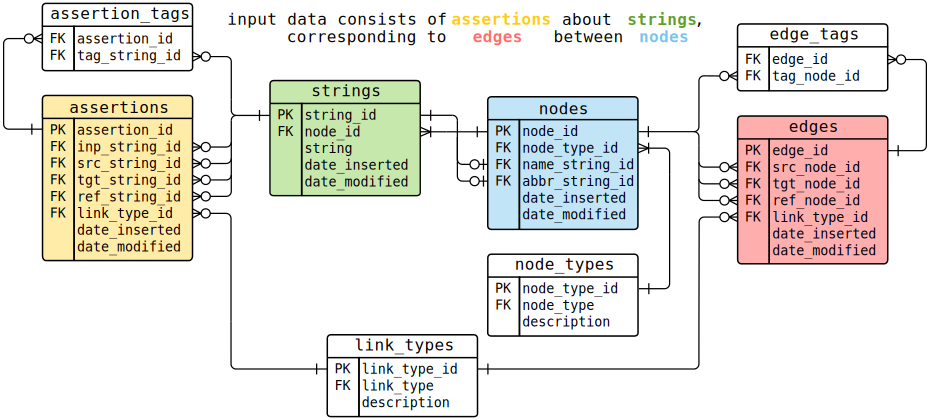

# bibliograph

### A database system for primary source research.

`bibliograph` is a Python package that implements a unique data model designed to help researchers analyze complex source material. The database was designed for academic studies in history, where researchers are often required to manage large amounts of ambiguous, inconsistent, or potentially contradictory information from a variety of sources.

I am testing the beta and I will document the code when I've gotten everything running for my current use case. `bibliograph` is [currently listed](https://pypi.org/project/bibliograph/) on the Python Package Index and you can install it with `pip install bibliograph`. If you're interested in using the database or getting updates on development, please let me know.

The [bibliograph data model](https://shortorian.github.io/bibliograph-data-model/) by Devin Short is licensed under [CC-BY 4.0](https://creativecommons.org/licenses/by/4.0/).

### Overview: picking your mess

"Data cleaning" typically destroys information: data are restructured such that references are uniform, duplicates are eliminated, and the database contains a "correct" representation of input data. In that process, a database is irreversibly separated from whatever sources generated the input data. The standard assumption is that inconsistencies in data are either entry errors or useless variations on a standard value. However, those variations between statements about the same things are exactly the kind of data historians and other researchers in the humanities would like to study. `bibliograph` retains the variations alongside normalized, queryable tables so users can access both the "clean" relationships they interpret from source material and the "messy" relationships in their sources.

As a simple example, consider a data set with assertions that "Miss Gerould", "Malkus, J.", "Joanne Simpson", "Gerould, Joanne", "Mrs. Malkus", and "simpsonj" represent contributors to scientific papers. These are all names of the same meteorologist. In the `bibliograph` schema, these string values are stored in one table and another table contains links between them and strings representing the papers. A third table has a single row representing one person and all the string values reference that row, which I call a node. A fourth table then stores links between nodes, so the node for Simpson could be linked to nodes representing articles she wrote. 

Critically, with a large data set, the set of assertions about strings that map to the same node will be inconsistent and include false statements. Simpson could be listed in the wrong position in an author list, she could be missing from an author list, have the wrong affiliation, etc. In a `bibliograph` database, all those inconsistent or incorrect relations are retained and the user can add, change, or remove links between nodes as-needed to reflect their preferred relations. This schema allows a researcher to easily ask questions about sets of sources:
- Which sources referred to Simpson as "Miss" or "Mrs." with a surname instead of using her full name?
- Did she use different names in different contexts?
- Did some journals or institutions require certain names?

"Clean" data often can't be used to answer those kinds of questions.

`bibliograph` asks a user to pick out a mess they can use to solve research problems.

### The data model

Most implications of the data model are contained in the sentence

    Input data consist of assertions about strings, which correspond to edges between nodes

As show in the diagram below, the database is built around four tables: **assertions**, **strings**, **nodes**, and **edges**.

- All text values are stored in the **strings** table
- The **assertions** table contains links between text values in sources: if a document says "A is author of B", a user might store "A" and "B" in the **strings** table and create a link of type "author" in the **assertions** table.
- Each string is mapped to a row in the **nodes** table which represents some entity outside the database: "A" above could get mapped to a node of type "person" and "B" could be mapped to a node of type "article."
- Rows in the **edges** table define links between nodes: if the source document above was incorrect and "A" was in fact the editor of "B", a user could create a link of type "editor" in the **edges** table.

The database exposes normalized relationships the user considers valid and simultaneously retains an accurate description of all source material. The **assertions** and **strings** tables represent statements in sources which could be valid or invalid and `bibliograph` helps a user interpret those statements as relationships between abstract **nodes** and **edges**.

Two things to note about the description above:
1. None of the example associations are hard-coded. A user can have "author" as a node type rather than a link type, the node types could be "actor" and "work", "A is author of B" could be stored twice in the **strings** table with each instance mapped to a different node, etc. The only constraint is that strings are mapped to nodes many-to-one: every row in the **strings** table points to only one node but any number of strings can refer to the same row in the **nodes** table.
2. No database can prevent bad input (all the statements about sources here assume a user has created input data that accurately describe their sources), but `bibliograph` allows a user to search for and resolve errors in ways they couldn't if data were cleaned before entry: when an error is suspected, users can compare the abstract relationships they think are correct with "raw" input values and more easily distinguish between user error and ambiguous sources. Rows in the **assertions** and **edges** tables contain optional metadata that allows users to quickly determine how to compare their input data to external sources. See the (forthcoming) documentation for details.

<!---
### A philosophy of data

The `bibliograph` project and the companion [`shorthand`](https://github.com/shortorian/shorthand) data entry system are part of an argument that good research should be grounded in good philosophy. There is a strong philosophical argument for the approach taken here, and I hope to articulate it more clearly over time as I complete the code and use it in my research.

The bibliograph schema is built on two ontological claims about sources:
1. Any map between signs like text and things in the world is fluid and ambiguous: the name "Simpson" is not the same thing as the person called Simpson.
2. When people use signs, they create things in the world that exist separately and have potentially unique histories even if the signs are semantically identical: the sequence of letters "Simpson" may appear in two different sources, but the sources are not the same object and so the two instances of "Simpson" are distinguishable even when they mean the same thing.

`bibliograph` implements these claims by separating assertions made in text from things that stand in for what the text represents (the nodes). This ontology allows a user to act on corresponding epistemological propositions about text data:
1. The map between assertions in text and abstract things the assertions refer to should change over time as new information demands changes to previously valid interpretations. `bibliograph` is structured such that these revisions can be made without losing information about sources.
2. We can make new knowledge by analyzing what has been said separately from what was meant or what is true. `bibliograph` promotes this sort of analysis by allowing a user to query a normalized set of nodes and links and then retrieve ambiguous statements made about those abstract entities.
--->
