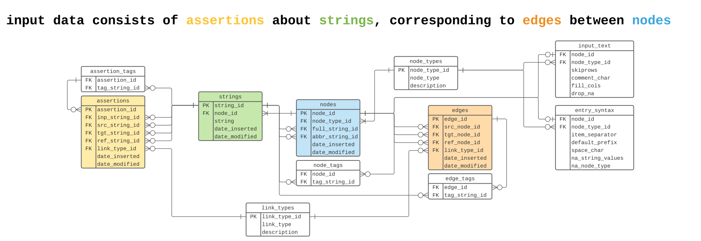

# bibliograph
A database system for humanities research projects.

`bibliograph` is a Python package that implements a unique data model designed to help researchers analyze complex source material. The database was designed for academic studies in history, where researchers are often required to manage large amounts of ambiguous, inconsistent, or potentially contradictory information from a variety of sources. `bibliograph` provides methods to store relations between entities as they are represented in source material ("assertions" users transcribe or annotate from sources) alongside abstract relations interpreted from the sources (edges between nodes created by a user). Researchers can therefore retain verbatim contents of sources while generating a normalized relational database that's easily queried. This is a solution to the "problem" of normalization: a historian might like to compare sources that mention Ada Lovelace as "Ada Lovelace" to those that use the name "Augusta Byron", but a normalized relational database typically requires awkward linking between entities with different names. `bibliograph` is designed to avoid normalized references to abstract entities and allow users to find relationships between sources that refer to the same entities in inconsistent or contradictory ways.

`bibliograph` is in early development, with an alpha release and documentation expected in summer 2022.

## The Data Model

Most of the implications of the data model are contained in the sentence

    Input data consists of assertions about strings, which correspond to edges between nodes

As show in the diagram, the database is built around four tables: **assertions**, **strings**, **nodes**, and **edges**.

- The **assertions** table contains links between string values that are contained in input files
- Each **string** is mapped to a **node** which represents some entity outside the database
- **Edges** define linkes between the **nodes**

**Assertions** reflect claims about input strings which could be valid or invalid, and the code gives the user tools to map **strings** to **nodes** and **assertions** to **edges**. The idea is to create a best-guess representation of the "real" relationship between things the strings represent.

Click [here](https://raw.githubusercontent.com/shortorian/bibliograph/main/2022_06_14_bibliographERD.svg) for a larger image.

As an example, I have a data set which contains assertions that the strings "Akasofu, S. -I", "Akasofu, S. -I.", "Akasofu, S. I.", "Akasofu, S.-I.", "Akasofu, Syun-Ichi", and "akasofusi" are all authors of scientific papers. In the `bibliograph` schema, all those statements are represented with rows in the assertions table which point to values in the strings table, and all of the strings above are mapped to one node that stands in for the person named Syun-Ichi Akasofu. That node then has edges connected to the nodes associated with articles on which the corresponding person’s name appears in the author list.

Critically, with a large data set, the set of assertions about strings that map to the same node will be inconsistent and include false statements. Akasofu could be listed in the wrong position in an author list, he could be missing from an author list, have the wrong affiliation, etc. In a `bibliograph` database, all those inconsistent or incorrect relations are retained in the assertions table, and the user can add, change, or remove links between nodes as-needed to represent the correct relations. 

The purpose of my approach is to retain ambiguities databases are generally designed to eliminate. Historians and other people who work with texts are interested in what a source says and how it says it even if it turns out to be false or inconsistent with other statements, so much of the information they care about is discarded if equivalent statements are always reduced to a standard form in a database.

This implies some ontological claim about text data:
1. Any map between signs like text and things in the world is fluid and ambiguous; the name "Akasofu" is not the same thing as the person called Akasofu.
2. When people use signs, they create things in the world that exist separately and have potentially unique histories even if the signs are semantically identical; the sequence of letters "Akasofu" may appear in two different sources, but the sources are not the same object and so the two instances of "Akasofu" are distinguishable even when they mean the same thing.

`bibliograph` implements these claims by separating assertions made in text from things that stand in for what the text represents (the nodes). This ontology allows a user to act on corresponding epistemological propositions about text data:
1. The map between assertions in texts and abstract things the assertions refer to should change over time as new information demands changes to previously valid interpretations. `bibliograph` is structured such that these revisions can be made without losing information about sources.
2. We can make new knowledge by analyzing what has been said separately from what was meant or what is true. Bibliograph promotes this sort of analysis by allowing a user to query a normalized set of nodes and links and then retrieve ambiguous statements made about those abstract entities.
